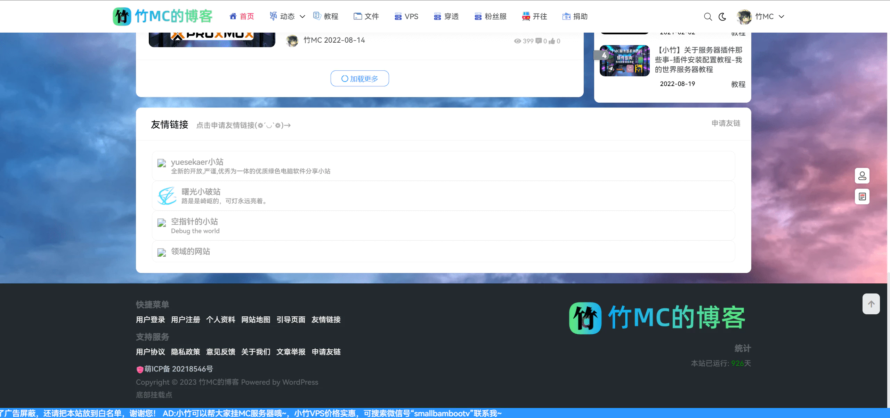

# 竹MC的博客

域名bamboomc.cn已在2025年07月27日到期，您现在访问的是GitHub Pages备份页，如需查看所有备份文件请访问 [https://github.com/SmallBambooCode/bamboomcblog-saved](https://github.com/SmallBambooCode/bamboomcblog-saved)。

## 首页

### 以下是保留的文章与页面的链接：

#### [教程目录](https://bamboomc.cn/help-online)

#### [群文件下载中心](https://bamboomc.cn/download)

#### [网站地图](https://bamboomc.cn/sitemap.html)

#### [友情链接](https://bamboomc.cn/links)

#### [开往（友链接力）](https://www.travellings.cn/go.html)

## 关站通知

尊敬的竹MC的博客读者们，

我谨代表竹MC的博客向大家致以最诚挚的感谢与问候。时光荏苒，我们的博客已陪伴大家走过了许多美好的时光（截至关闭时博客已运行929天）。然而，基于一系列考虑，我们不得不做出一个重要的决定：竹MC的博客将于2023年8月7日关闭，并转换为由typora生成的静态页面。

这个决定并不是轻率的，它涉及到我们面临的多种挑战，包括资金限制和网站流量问题。在这个过程中，我们认真考虑了多种解决方案，并认为将博客转换为静态页面是目前最为合适的选择。这一举措不仅有助于降低网站维护成本，也能提供更稳定和快速的用户体验。

请放心，虽然我们关闭了大部分页面，但我们将保留所有重要的文章和页面，以确保您可以继续访问和查阅这些有价值的内容。这些文章将作为静态页面的一部分，继续为大家提供有用的信息。

同时，我们也明白这对一些忠实读者可能是一个不便，对此我们深表歉意。如果您有保存自己喜欢的文章的需求，请在[bamboomc.cn/saved.zip](https://bamboomc.cn/saved.zip)下载所有文章、页面和图片（由WordPress导出工具生成+COS对象存储导出）。

此外，我们想对所有支持竹MC的博客的读者们说声谢谢。您的支持是我们前进的动力，也是我们坚持追求博客内容质量的源泉。尽管博客将以不同的形式存在，但我们团队将继续分享有趣、有见地的内容，与您保持紧密的交流。

感谢您长久以来对竹MC的博客的支持与理解。如果您对关闭后的新静态页面有任何疑问或建议，欢迎随时联系我们，我们会尽力解答您的问题。

衷心感谢您的陪伴！

竹MC 敬上

## 截图留念

